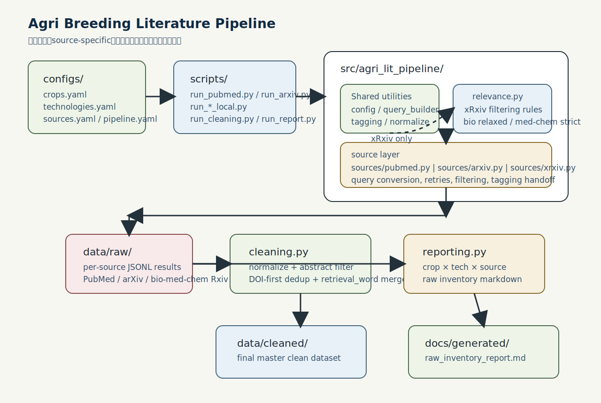
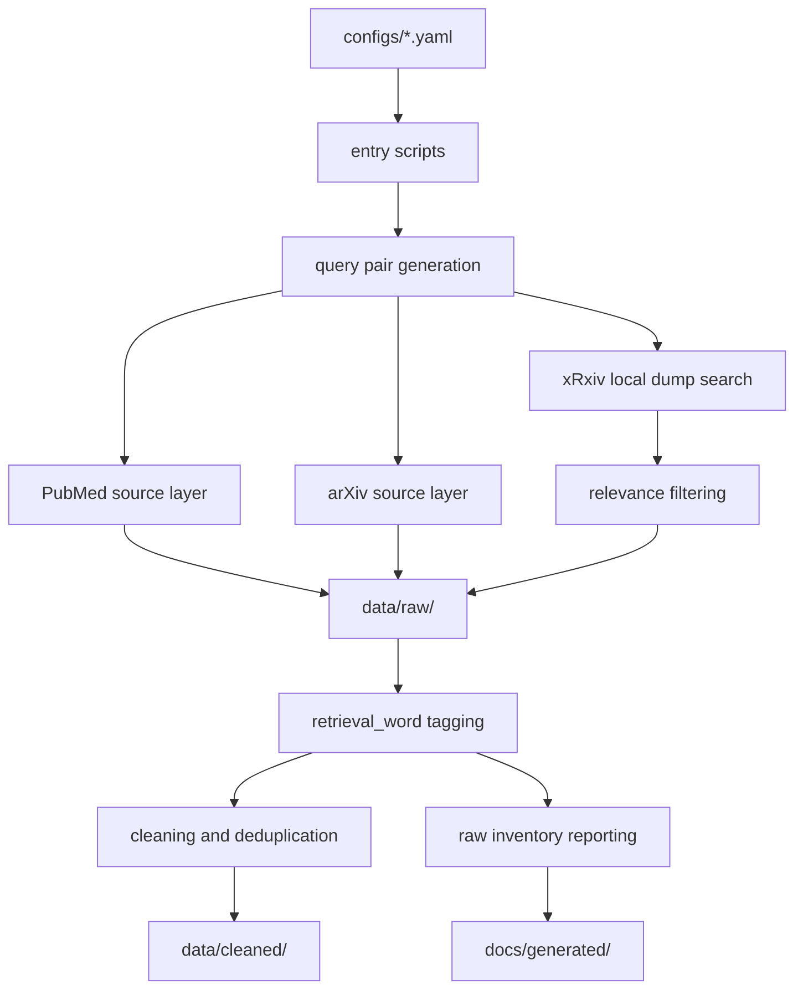

# Architecture

## Overview

The project is organized as a configuration-driven workflow for agricultural breeding literature retrieval and downstream processing. It supports online retrieval for PubMed and arXiv, local dump search for bioRxiv, medRxiv, and chemRxiv, and downstream cleaning, deduplication, and raw inventory reporting.

The main engineering goal is not to hide source differences behind a single opaque abstraction. Instead, the repository keeps source-specific behavior in the source layer while sharing configuration loading, query pair generation, tagging, cleaning, and reporting utilities.

## Layers

### Entry Scripts

Entry scripts live in `scripts/`. They should remain thin:

- Load `configs/*.yaml`
- Normalize paths
- Generate query pairs
- Call source, cleaning, or reporting modules

They are not intended to contain substantial business logic.

### Shared Utilities

Shared modules live under `src/agri_lit_pipeline/`:

- `config.py` loads configuration.
- `query_builder.py` generates crop and technology query pairs.
- `tagging.py` adds `retrieval_word` metadata.
- `relevance.py` contains lightweight xRxiv relevance filtering rules.
- `normalize.py` supports title and DOI normalization.

### Source Layer

Source-specific retrieval logic lives in `src/agri_lit_pipeline/sources/`:

- `pubmed.py` handles PubMed online retrieval.
- `arxiv.py` handles arXiv online retrieval and source-specific query string construction.
- `xrxiv.py` handles shared local dump search behavior for bioRxiv, medRxiv, and chemRxiv.

xRxiv relevance filtering is kept close to the source layer because candidate quality and noise patterns differ by source.

### Cleaning Layer

`cleaning.py` standardizes raw records, filters records with insufficient abstracts, deduplicates by DOI or normalized title, and merges `retrieval_word` values across duplicate records.

### Reporting Layer

`reporting.py` generates a raw inventory report by crop, technology, and source. This report describes raw retrieval output volume; it is not a final cleaned quality evaluation.

## Data Flow

The repository documents this flow, but it does not publish full raw dumps, full cleaned corpora, or private datasets.
